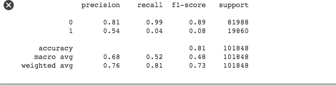

# Eluvio DS Challenge

## Define a problem

Through pandas to read the csv files, I just found the file contains 8 columns(509236*8): ["time_created"、"date_created"、"up_votes"、"down_votes"、"title"、"over_18"、"author" and "category"].

After simple checking, the column called "down_votes" are found all "0" and the column named "category" are all shown as "worldnews", so those two features are useless, and just drop them. So there are 6 columns left.

Since there is no clear label, I want to set my own label based on the features value. In my opinion, whether the news is attracting or not can be a label, and by the virtue of "up_votes" values, the news can be easily split to be two parts(Ones are attracting news and the others are not attracting news). And this is very intuitive and reasonable since there should be more "up_votes" if the news is attracting.

So which columns can be  features affecting the label(attracing news or not)? Obviously, the "title" should be one feature, since if the title is attracting, there should be more people to read and more probably to like it. And the "over_18" should also be one factor since age will sometimes or to some extent determine their interest. And "author" have to be one factor since some famous actor will be more likely to get likeness. And the time columns [time_created, date_created] should have some influences on the label but I do not think the effect is huge, so here I just drop them. 

And there are 85838 authors, which is too much if we do one-hot encoding, so here let us just dropped it first.

After clarification, here is a classification problem, the label is whether a news is attracting or not(based on "up_votes") and the features are ["title", "over_18"]. In this problem, I just use the feature ['title'] to simplify the problem.

# Data preprocessing

Use nltk package to preprocess the "title" and then use tfidfVectorizer to vector "title", and after preprocessing, I got 509236*1814 vector. And here I just set the threshold to be 0.8 quantile. 

# Models

I just split the data into two parts, one part is train data, with 0.8 size of whole data, and the other is test data, with 0.2 size of whole data.

## MultinomailNB

By applying multinomailNB model, I just got the test accuracy to be 0.805. And the classification report is as follow:

## LogisticRegression

By applying logisticRegression with penalty factor 1.0, the test accuracy is 0.806. And the classification report is as follow:

## GBDT

## Random Forest

By setting the max_features = "sqrt" and n_estimators = 10, I just got the test accuracy is 0.793.

## XGB

The test accuracy is 0.806.

# Conclusion

All the simple machine learning model shows that the title hava a very strong relationship with up_votes(whether the news is attracting or not).

Maybe applying deep learning method will show us more accurate result. But the size of datasets are too big, my machine cannot support it.

Also, by introducing "over_18" and "author" should improve our model.

